# Milestone Project 2: Super Quiz
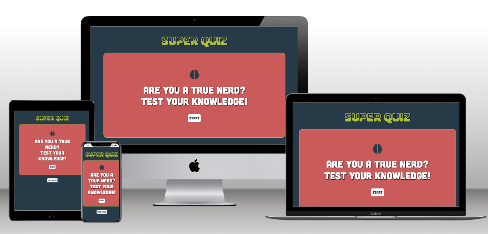
## Project Overview

**Super Quiz** is an interactive, single-page quiz application built with **HTML**, **CSS**, and **JavaScript**. It challenges users with 10 nerd-culture questions, each having four possible answers. The app features dynamic question loading, score tracking, time limits, and immediate visual feedback on answers.

This project was developed for the **second milestone of the Full Stack Web Development program** at Code Institute.

---

## Features

**Start screen**  
  

**Game screen**  
  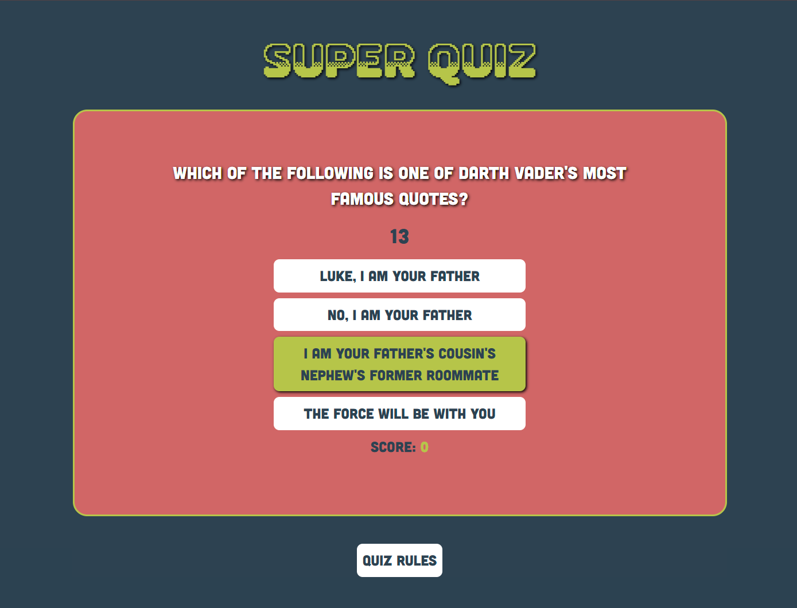

**End screen**  
  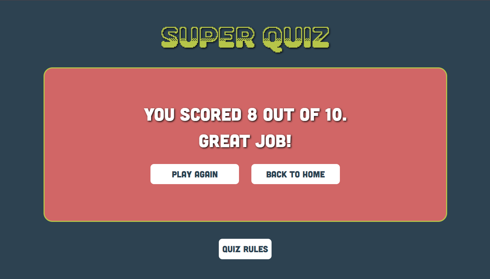

**Quiz rules modal**  
  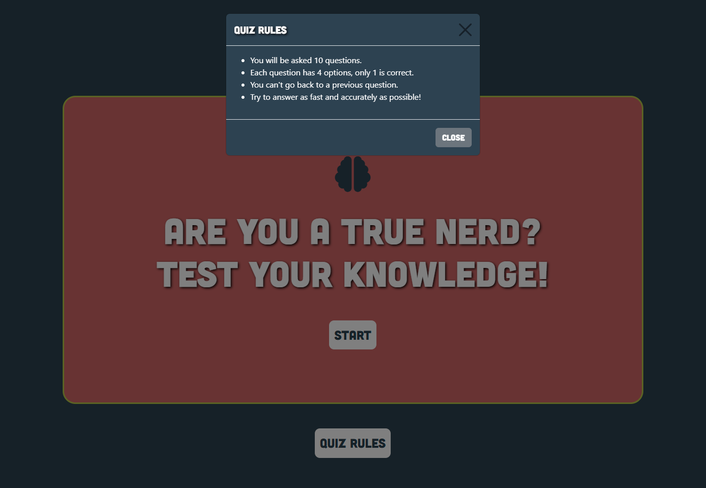

### Core Features
- **Start Screen:** Welcomes users and provides a clear CTA to begin the quiz.
- **Timed Questions:** Each question has a 15-second countdown timer.
- **Score Tracking:** Displays the user's current score throughout the quiz.
- **Immediate Feedback:** Correct answers turn green, wrong ones red.
- **Final Score Summary:** Personalized end screen based on user performance.
- **Modal Popup:** Displays quiz rules using a Bootstrap modal.
- **Play Again:** Allows users to restart the quiz after completing.

### Responsive Design
- Designed to work across various screen sizes (desktop, tablet, and mobile).
- Media queries adjust layout, font sizes, and button dimensions for smaller screens.

---

## How It Works

1. Click **Start** to begin the quiz.
2. Answer 10 questions (each has 15 seconds).
3. One point is awarded for each correct answer.
4. Feedback is given in real-time with color-coded buttons.
5. After the final question, a custom message appears based on the score.
6. Option to **Play Again** or return to the **Start Screen**.

---

## Responsiveness & Accessibility

- Uses large clickable buttons and clear font contrasts for accessibility.
- Ensures readability and usability on small screens with scalable text and responsive buttons.

---

## Usage

Once opened in a browser:

- Click the **Start Quiz** button.
- Answer all 10 questions.
- Review your final score.
- Click **Play Again** to retry.

---

## Screenshots

### Wireframes

**Start screen Wireframe**  
  

**Game screen Wireframe**  
  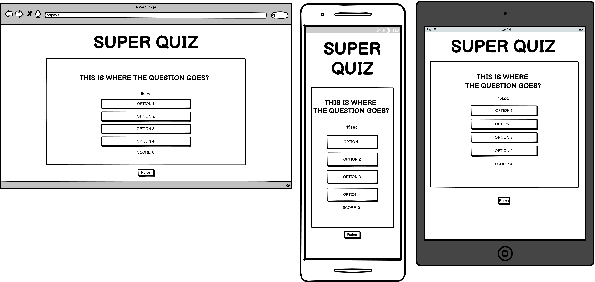

**End screen Wireframe**  
  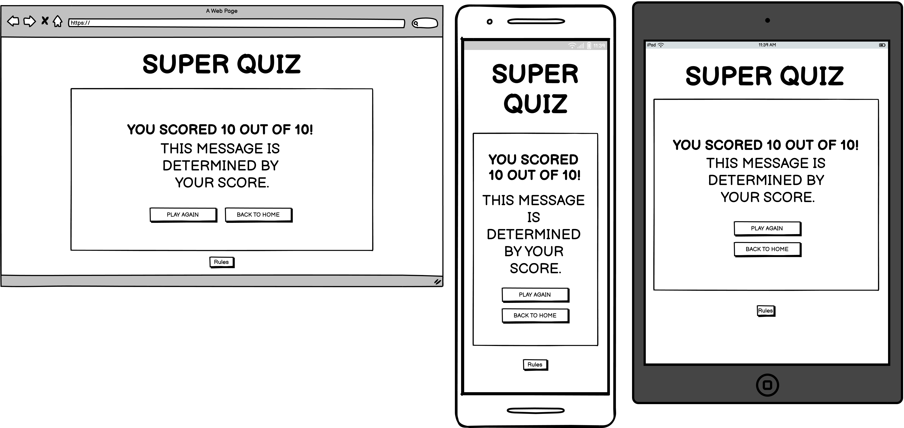

**Quiz Page Wireframe**  
  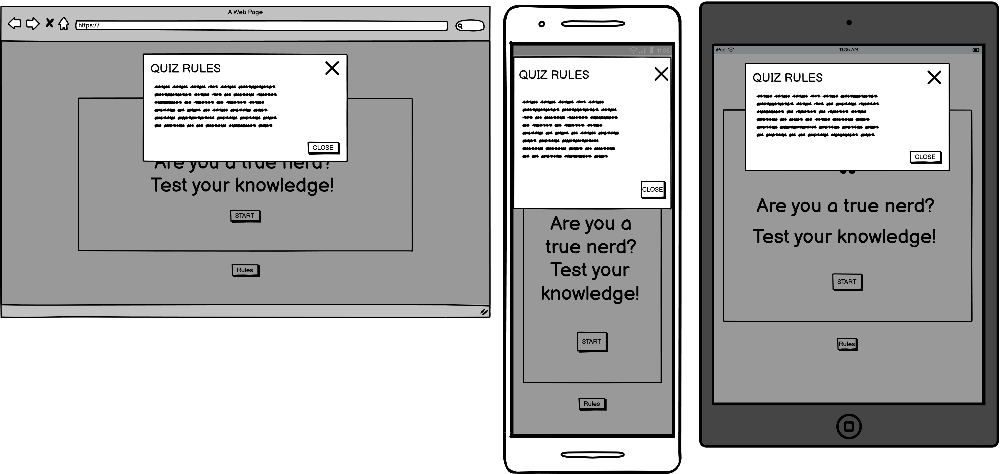

---

## User Stories

- As a user, I want to see a clear start screen so I know how to begin.
- As a user, I want a timer for each question to make it more challenging.
- As a user, I want feedback after answering to know if I was correct.
- As a user, I want to track my score as I play.
- As a user, I want to replay the quiz after finishing.

---

## Technologies Used

- **HTML5** – Page structure and semantic layout.
- **CSS3** – Custom styles with media queries and variables.
- **JavaScript** – Handles game logic, DOM manipulation, and timers.
- **Bootstrap 5** – Used for the modal and some responsive layout utilities.
- **Font Awesome** – Provides icons (e.g., brain icon on start screen).
- **Adobe Fonts** – Custom arcade-style typography.

---

## Attributes / Design Choices

### Color Palette (from Coolors)

- Pink (`#D16666`) and Lime Green (`#b6c649`) for retro arcade vibe.
- Dark Blue (`#2C4251`) and white (`#FFFFFF`) for contrast.
- Each color were assigned to variables that can be easily updated at the top of the CSS.

### Typography (fonts from Adobe Fonts)

- "Puffin Arcade" and "Cubano Sharp" evoke a fun, game-like style.

### Button Styling

- Buttons are large, hoverable, and visually responsive to user input.

### Graphics

- The logo of the page, "Super Quiz", was written directly in the header using the font "Puffin Arcade" and the favicon version was created in Photoshop and then resized appropriately using [favicon.io](http://favicon.io/favicon-converter/).
- The **brain** icon on the start screen was taken from [Font Awesome](https://fontawesome.com).

---

## Testing

### Lighthouse
  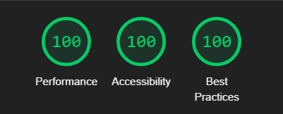

### HTML & CSS Validation

**HTML**:

HTML validation gave a warning regarding the unnecessary type attribute:

  

After removing the type:

  

**CSS**: 

  

### Accessibility Testing
Wave testing gave errors for all the answer buttons as they didn't initially have any values:
  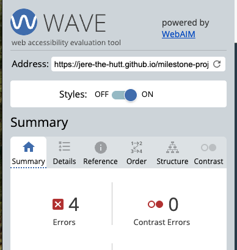

Fixed the issue by adding values to the buttons in html:
  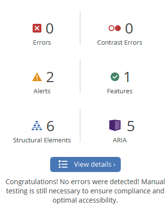

### JavaScript testing
Testing the JS in JSHint resulted in 17 warnings regarding the arrow function syntax:
  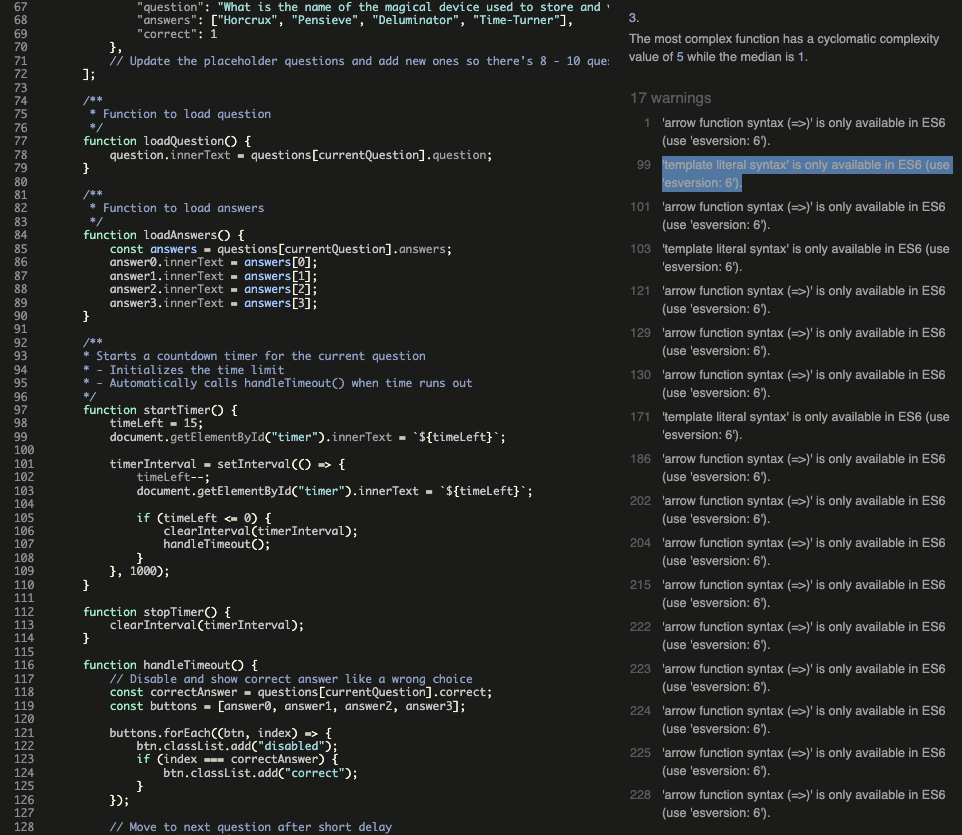

I added "/* jshint esversion: 6 */" to the top of my JavaScript file and JSHint gave me these metrics:
  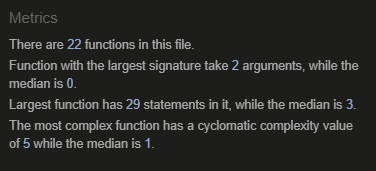

### Testing Across Different Devices

- Manual testing of all buttons and timer functionality.
- Tested on Chrome, Safari, and Edge.
- Mobile responsiveness checked using dev tools and physical devices.
- Lighthouse and WAVE tools used for accessibility and performance checks.

### Manual User Testing

- The **Start Screen** features a greeting, a **Start Quiz** button and a **Quiz Rules** button.
- Clicking the **Start Quiz** loads the first question, four answer options, starts the timer and shows the initial score.
- Clicking the **Quiz Rules** opens up a modal that has a list of the quiz rules.
- In the **Quiz Rules** modal, clicking either the **X** or **Close** closes the modal.
- Clicking a correct answer colors the chosen button green, increments the score and moves on to the next question.
- Clicking a wrong answer colors the chosen button red and highlights the correct one with green, then moves on to the next question.
- Reaching the end of the quiz, the user gets a message and the final score based on their performance with **Play Again** button and **Back To Home** button.
- Clicking **Play Again** reloads the first question of the quiz and resets the score.
- Clicking **Back To Home** reloads the entire page and takes the user to the start screen.

---

## Bugs And Issues

- Hover effect got stuck on mobile devices, but was resolved by removing the hover function in CSS and replacing it with focus and active rules.

- Uncaught Type Error
  
---

## Future Development

- Include more question sets or categories.
- Add sound effects for correct/wrong answers.
- Add animations/transitions for better user experience.
- In the end screen, the user can open a modal to show all the correct answers next to user's own answers.

---

## Deployment via GitHub Pages

To deploy the website to GitHub Pages, I followed these detailed steps:

### 1. **Push Your Code to GitHub**
   - Make sure your latest code changes are pushed to the **main** (or **master**) branch of your GitHub repository.
   - If you haven't pushed your code yet, run the following commands:
    
     git add .
     git commit -m "your commit message"
     git push origin main

### 2. **Navigate to the GitHub Repository**
   - Go to the GitHub repository: [milestone-project-2-quiz](https://github.com/Jere-The-Hutt/milestone-project-2-quiz).

### 3. **Open Repository Settings**
   - In the top right of the repository page, click on the **Settings** tab.

### 4. **Configure GitHub Pages**
   - In the left sidebar under **Code and automation**, click on **Pages**.
   - If this is your first time setting up GitHub Pages, you will be taken to the **GitHub Pages** configuration page.

### 5. **Set the Branch and Folder for Deployment**
   - Under **Source**, select **Deploy from a branch**.
   - From the dropdown list, select the **main** branch.
   - For the **Folder** option, select `/ (root)` to deploy from the root directory of your repository.

### 6. **Save Your Settings**
   - Click the **Save** button to apply the settings.

### 7. **Access Your Deployed Site**
   - Once you've saved, GitHub will give you a link to your deployed site in the **GitHub Pages** section.
   - The URL: `https://jere-the-hutt.github.io/milestone-project-2-quiz/`
   - Access the deployed version of the site through this link.

---

## Acknowledgements

- Credit for the first question of the quiz, "Which of the following is one of Darth Vader's most famous quotes?", goes to my classmate **Daniel Rydholm**.
- My mentor **Spencer Barriball** for much needed guidance.
- **VS Code** for building the code.
- **GitHub** for storage and deployment.
- **Balsamiq** for the wireframe.
- Modal structure adapted from [Bootstrap documentation](https://getbootstrap.com).
- Color palette via [Coolors](https://coolors.co/).
- Fonts via [Adobe Fonts](https://fonts.adobe.com).
- Icons via [Font Awesome](https://fontawesome.com).
- **ChatGPT** (**OpenAI**) for creating a clean and structured ReadMe layout.

